# Smart Water Guardian — UI Design System

## 1. Purpose

This document explains the visual design principles of the **Smart Water Guardian** application. The purpose is to ensure consistency within the application's pages, components and responsive layouts.

## 2. Typography

- **Primary Font:** Inter
- **Fallback Font:** Sans-serif
- CSS font references also include `BlinkMacSystemFont` and `apple-system` so the browser can use the operating system's default UI font.

## 3. Core Colour Palette

| Name | Value | Purpose |
|---|---|---|
| Primary | `#1a365d` | Main brand/navigation colour |
| Primary Light | `#2b6cb0` | Links and lighter brand elements |
| Primary Dark | `#0d1b2a` | Dark navigation/background areas |
| Secondary | `#48bb78` | Positive/action elements |
| Accent | `#ed8936` | Accent/informational elements |
| Danger | `#e53e3e` | Error/danger states |
| Purple | `#805ad5` | Secondary accent |
| Text | `#1a202c` | Main text |
| Text Light | `#4a5568` | Secondary text |
| Text Muted | `#a0aec0` | Supporting/muted information |
| Background | `#f0f4f8` | Main application background |
| White | `#ffffff` | Cards and light surfaces |

## 4. Spacing and Shape

- **Standard Border Radius:** `12px`
- **Large Radius:** `20px`
- Rounded elements are used for cards, buttons, authentication components and other interface surfaces.

## 5. Buttons

Reusable button classes include:

- `.btn`
- `.btn-primary`
- `.btn-outline`
- `.btn-full`

Buttons use consistent padding, font weight, border radius, transitions and hover states.

## 6. Responsive Design

The application includes responsive breakpoints at approximately:

- `1200px`
- `992px`
- `768px`

At smaller screen sizes, multi-column layouts are progressively converted into smaller or single-column layouts, and the sidebar changes behaviour.

## 7. Dark and Light Themes

The application supports **dark and light themes**.

Theme preferences are managed by `assets/js/preferences.js`. The preference is stored locally and can also be synchronised with Firebase for authenticated users.

Pages implementing theme variables use `body.light-mode` to modify backgrounds, cards, inputs, text, borders, accent colours and shadows.

### Light and Dark Modes

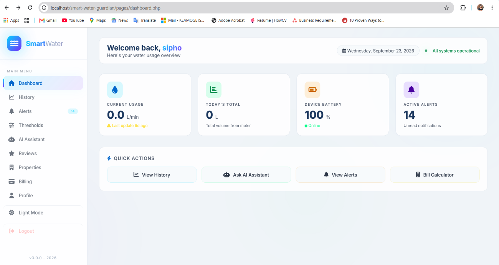

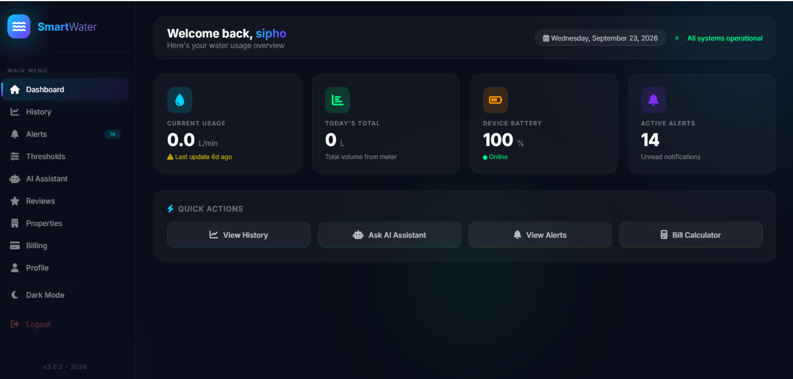

## 8. Smart Water Guardian App — Before

### Previous Sign-in Page

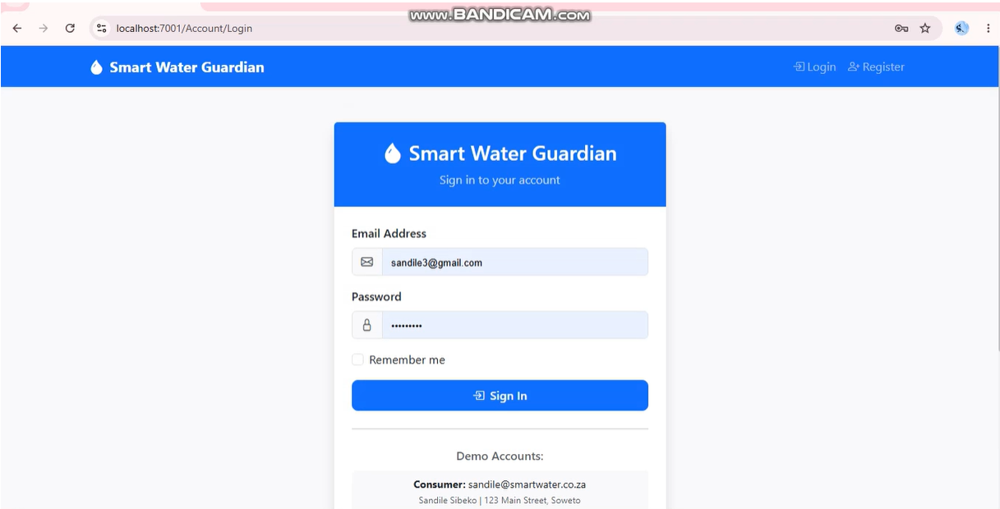

### Create Account

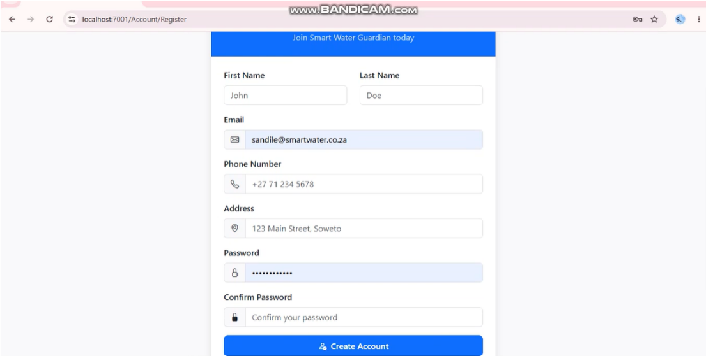

### Get Started

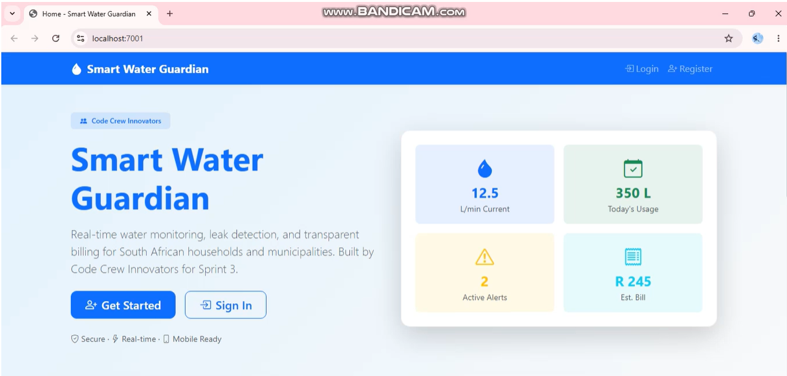

### Home Page

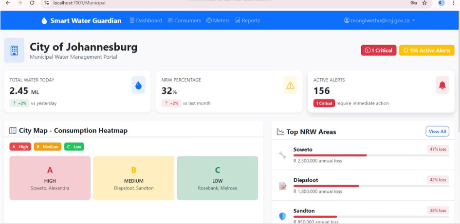

### Alerts Page

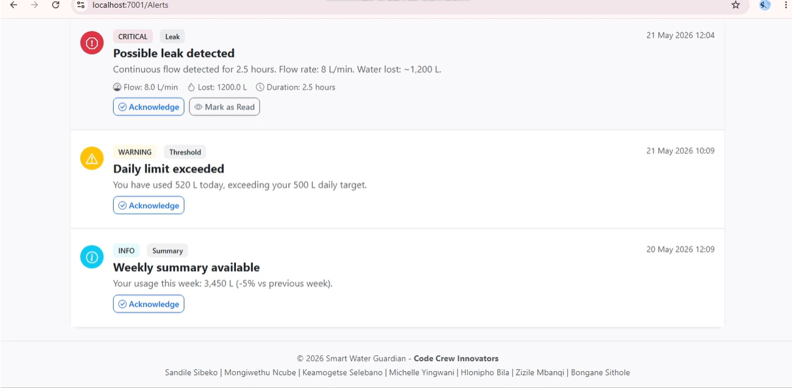

### Alerts Page — Additional View

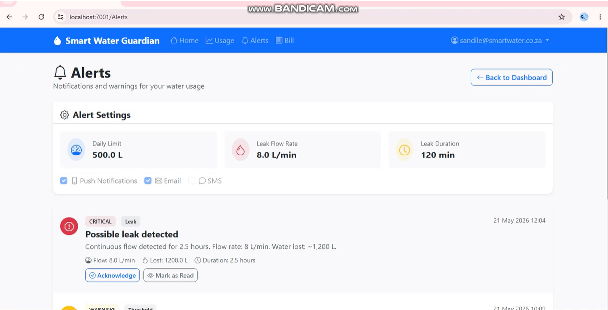

### Bill Estimate

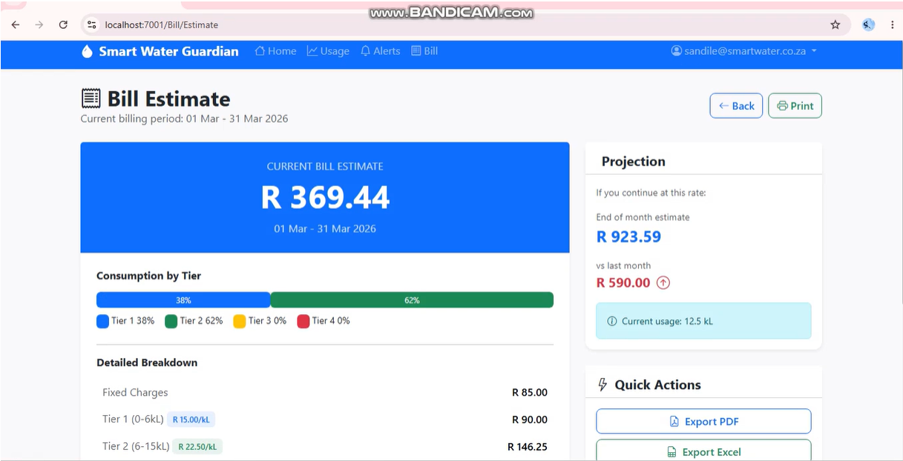

### Bill / Invoice

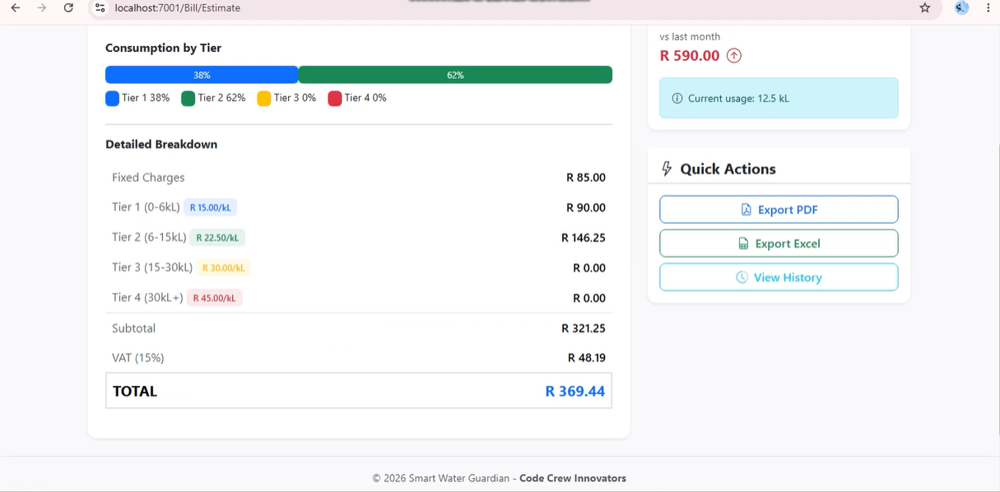

## 9. New Updated Smart Water Guardian App

### Updated Create Account Page

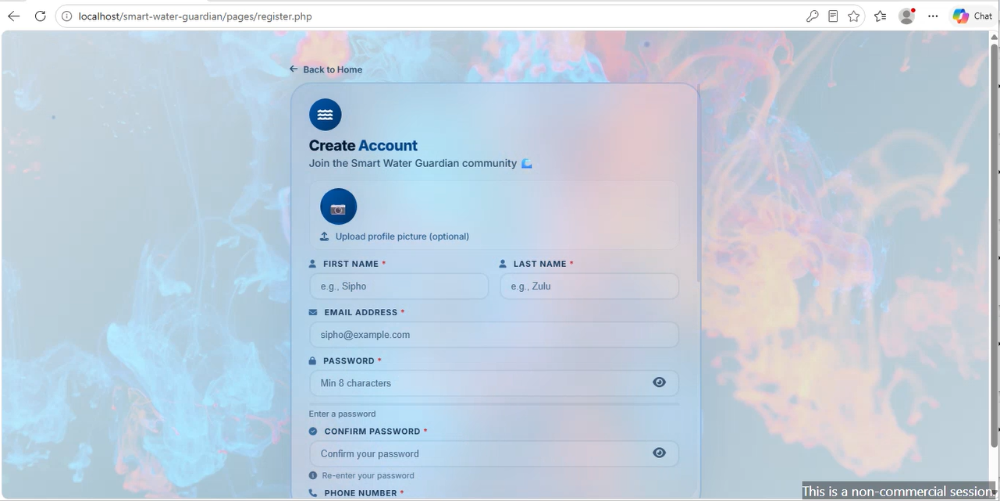

### Updated Get Started Page

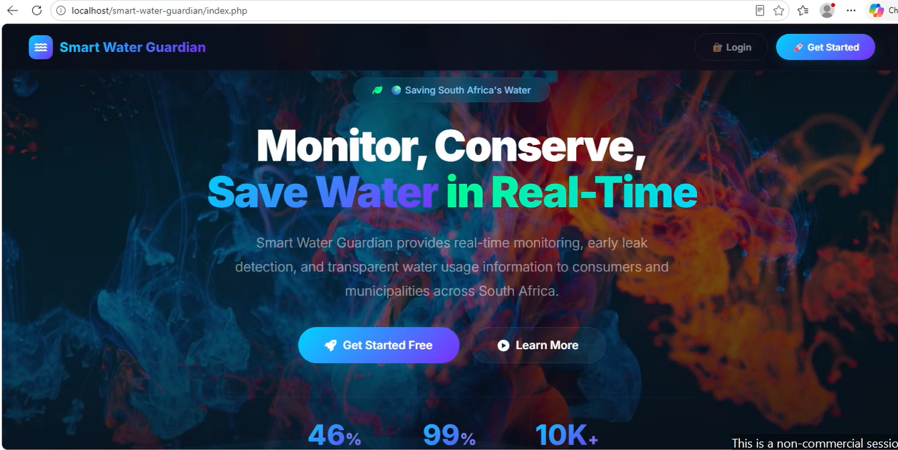

### Water Usage History

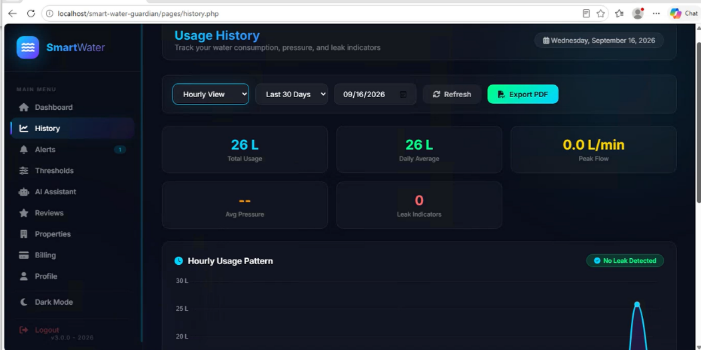

### Water Usage History — Additional View

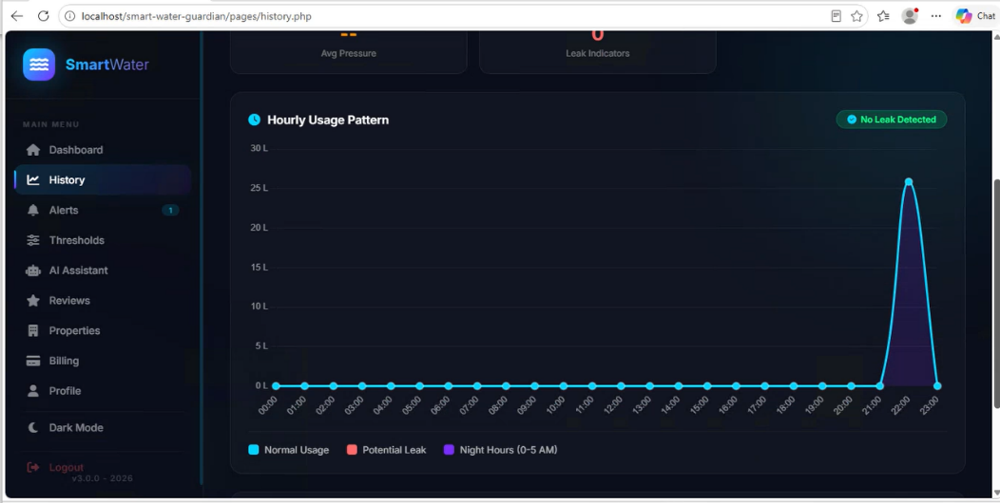

### Dashboard

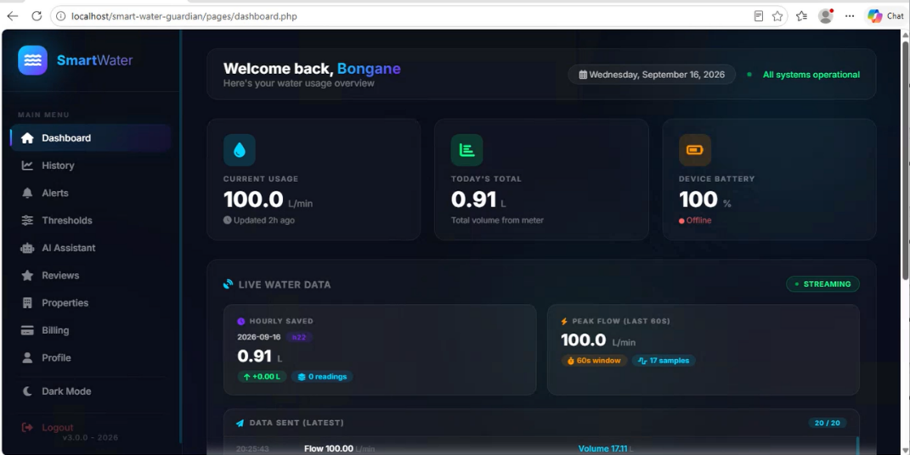

## 10. Changes Made and Why

The Smart Water Guardian interface was redesigned from a basic, desktop-focused prototype into a more responsive, user-friendly, and visually consistent application.

One of the key improvements was replacing the crowded top navigation with a scalable **left-hand sidebar**, making it easier for users to locate and access the different sections of the application.

The dashboard was also enhanced by improving the presentation of key metrics and providing additional context around the displayed information.

A **dual-theme approach** was introduced, including dark and light modes, to provide users with greater flexibility and improve visual comfort, particularly for users who may interact with the system for extended periods.

Additional features, such as the **AI chatbot**, were incorporated to provide users with easier access to assistance and information within the application.

The overall redesign focused on improving navigation structure, visual consistency, responsiveness, readability and user support so that users with different levels of digital experience can interact with the system more comfortably.

## GitHub Project Notes

**Project:** Smart Water Guardian  
**Document:** UI Design System  
**Purpose:** Define the application's visual design, responsive behaviour, themes, components and major UI improvements.

> **GitHub structure:** Keep this `README.md` in the project root and keep the `assets` folder next to it so all screenshots render correctly on GitHub.
